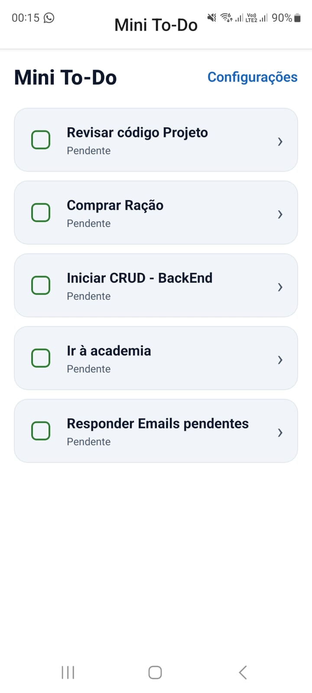
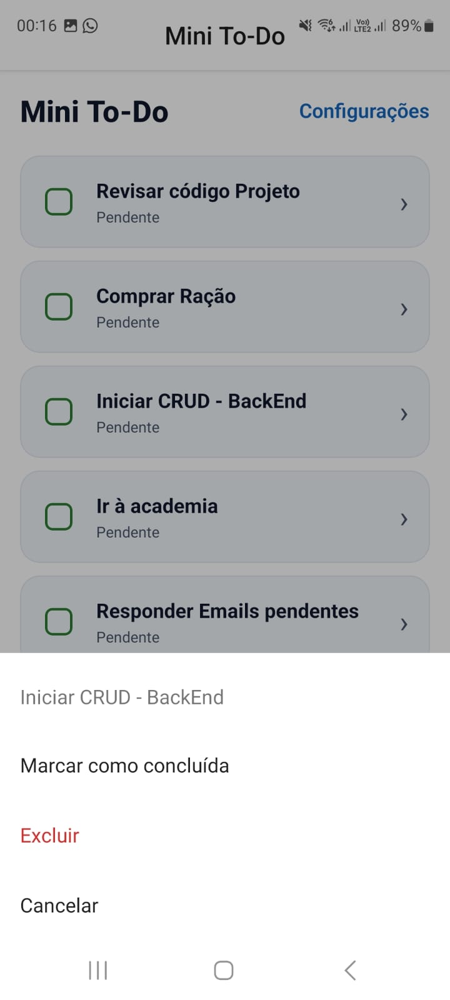
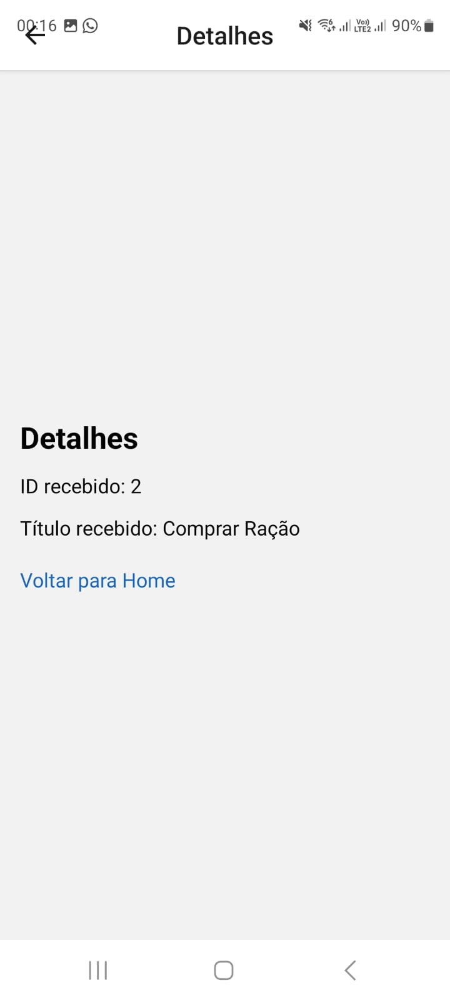

# 📱 Mini To-Do (Expo + TypeScript)

## O que o app faz
- Lista tarefas (dados fake) com **FlatList**.
- Cada item usa um componente com **props**, **useState** e **useEffect**.
- Navega entre **Home → Detalhes → Configurações** via **Expo Router**.
- Envia **parâmetros** para a tela de Detalhes (`id`, `title`).
- **Toque longo** abre **ActionSheet** com ações: *Marcar como concluída* e *Excluir*.

## Prints das telas
<p align="center">
  
  
  
</p>

## Como executar

```bash
# 1) Instalar dependências
npm install ou yarn install

# 2) Iniciar o bundler
npm run start ou yarn start

# 3) Abrir no dispositivo:
# - Instalar app Expo Go (PlayStore)
# - Expo Go (escaneie o QR Code)
